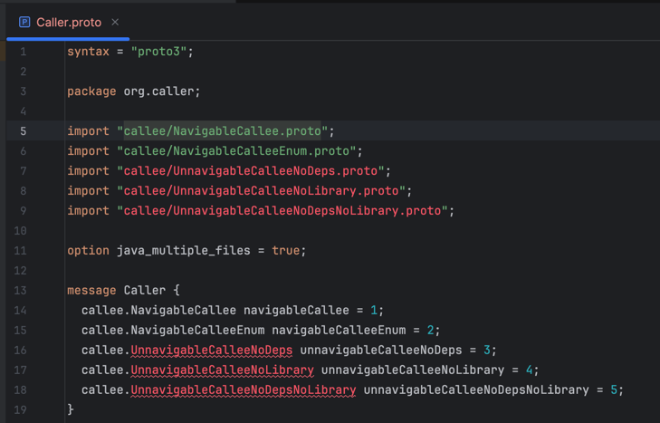
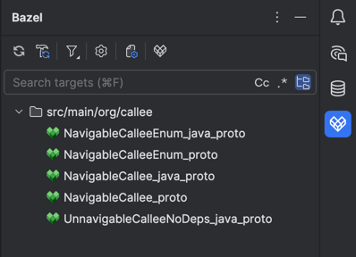

# Problem
Protobuf cannot navigate to another protobuf. Only if you have proto_library.deps + java_proto_library, then you can navigate.

# Environment
- IntelliJ IDEA 2025.2 (Ultimate Edition)
- Bazel plugin 2025.2.4
- Protocol Buffers 252.23892.409

# Reproduction Steps
1. Bazel plugin: Build and Resync Project
2. You should see the following behavior:
- Go to `proto-to-proto-navigation/src/main/org/caller/Caller.proto`, cmd+click works for NavigableCallee, NavigableCalleeEnum

- Go to bazel plugin panel, only some targets are available (the ones with java_proto_library)
